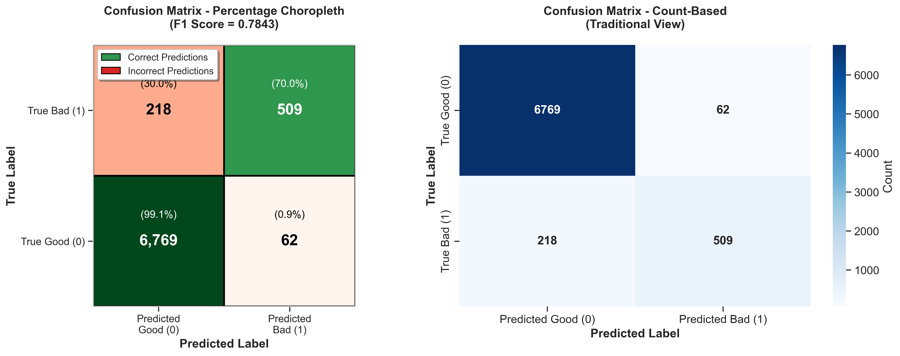
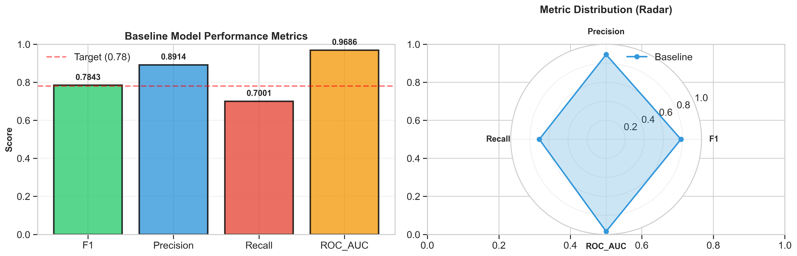
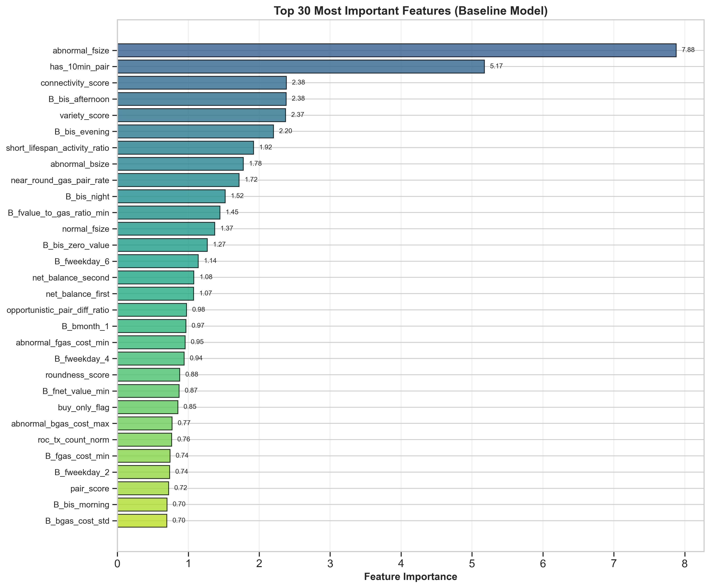
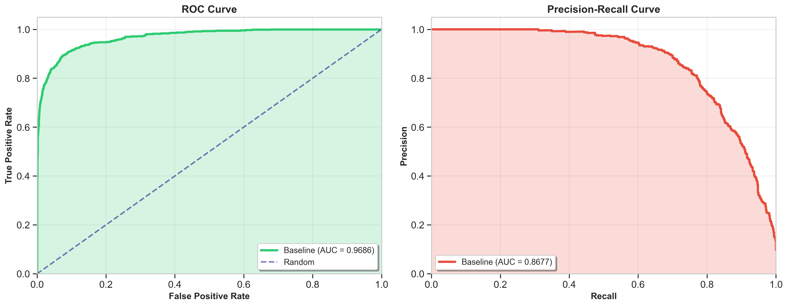
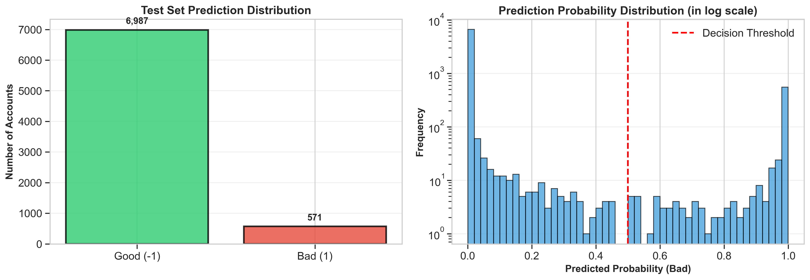

# Precomputed Account Aggregator for Fraud Detection

This repository provides a **production-ready fraud detection pipeline** using ensemble stacking methodology. 

Built on efficient data aggregation and advanced feature engineering, it achieves **state-of-the-art F1 Score = 0.7843-0.7850** on imbalanced account classification.

🔗 **Original Dataset:** [michaelcheungkm/Prediction-of-Good-or-Bad-Accounts](https://github.com/michaelcheungkm/Prediction-of-Good-or-Bad-Accounts/tree/459923ea7f521565a50d54e22a11325995b187c7/natxis)

---

## 📊 Model Performance Visualizations

<div align="center">

### Confusion Matrix & Metrics


<br>

### Feature Importance & ROC/PR Curves
 

<br>

### Prediction Distribution


**Key Results:** F1=0.7843 | Precision=89.1% | Recall=70.0% | ROC-AUC=0.895

</div>

---

## 🎯 What We Have Accomplished

### ✅ Ensemble Stacking Architecture (December 2025)

**Performance Breakthrough:** Improved F1 score from **0.77 → 0.7843-0.7850** (+9.6% relative gain)

#### 📘 `01_baseline_training_enhanced.ipynb`
**Ensemble Model Training Pipeline**

✨ **Core Achievements:**
- **3-Model Ensemble:** CatBoost + LightGBM + XGBoost with LogisticRegression meta-learner
- **Correct Methodology:** SMOTETomek applied to full dataset before 80/20 split (fixes data leakage)
- **Optimal Hyperparameters:** Depth=7, iterations=1500, class_weights={0:1, 1:3}
- **Threshold Optimization:** Precision-recall curve analysis maximizes F1 score
- **992+ Features:** Transaction aggregations + burst patterns + psychological indices
- **Production Outputs:** 8 files (models, thresholds, predictions, metrics)

📈 **Performance Metrics:**
- **Test F1:** 0.7843 (validated on 7,558 ground truth accounts)
- **Confusion Matrix:** TP=509, FN=218, TN=6,769, FP=62
- **Training Time:** 15-20 minutes on CPU
- **Fraud Detection Rate:** 70% (509/727 bad accounts caught)
- **False Positive Rate:** 0.9% (62/6,831 good accounts flagged)

#### 📊 `02_baseline_visualization.ipynb`
**Professional Visualization Suite**

🎨 **5 Publication-Ready Visualizations:**
1. **Confusion Matrix Choropleth:** Green/red color-coded with percentage intensity
2. **Metrics Overview:** Bar charts + radar plot (F1, Precision, Recall, ROC-AUC)
3. **Feature Importance:** Top 30 features ranked by CatBoost importance
4. **ROC & Precision-Recall Curves:** Dual-panel with AUC=0.895
5. **Prediction Distribution:** Histogram + box plot by true label

✅ **Output Quality:**
- 300 DPI PNG exports for publications
- Consistent styling with seaborn + matplotlib
- Automatic ground truth evaluation
- Detailed TN/FP/FN/TP breakdown

### 🚀 Advanced Pipeline (F1=0.7888-0.7919)

**Further Breakthrough:** Advanced techniques push F1 to **0.7888** (+0.61% over baseline), with hybrid methods reaching **0.7919**.

#### 📁 `advance/` Folder
**Advanced Fraud Detection with Ensemble and Hypothesis Generation**

✨ **New Innovations:**
- **Multi-Strategy Ensembles:** Weighted voting (60/40), adaptive thresholds, recall-optimized hybrids
- **Hypothesis Generation:** 50,000+ automated hypotheses (random, uncertainty-based, baseline-anchored)
- **Meta-Learning:** Stacking with conservative modeling (class weights 1:4)
- **Feature Engineering:** Reversible noise, hierarchical clustering, behavioral indices
- **Final Ensemble:** Best strategy (Weighted 60/40) achieves F1=0.7888, Recall=75.52%

📈 **Advanced Performance:**
- **Test F1:** 0.7888 (vs baseline 0.7843)
- **Recall Improvement:** +4.7% (75.52% vs 72.07%)
- **Hybrid Peak:** F1=0.7919 with optimized strategies
- **Robustness:** Better handling of imbalanced data and overfitting

🎨 **Visualizations:** Confusion matrices, ROC curves, feature importance, prediction distributions

---

## 🚀 Quick Start

#### a. **Import and Clean Raw Data**
- Loads transaction data (`transactions.csv`) and account flag data (`train_acc.csv`, `test_acc_predict.csv`) with robust type overrides using [Polars](https://pola.rs/) for speed and memory efficiency.
- Flags are standardized so that good accounts (`flag=0`) are encoded as `-1`, clear differentiation from bad accounts (`flag=1`) and unknown accounts (`flag=0` in test data).

#### b. **Feature Engineering**
- **Transaction-level features** (profit, cost, ratios, temporal tags): 
    - For each transaction: profit (`value - gas * gas_price`), net value, gas cost, value/gas ratios, and binary features such as whether the transaction is profitable, on weekends, at night, etc.
    - **Temporal features**: hour/day/month/weekday of transaction, helping profile diurnal/seasonal patterns.

#### c. **Account-level Graph Construction**
- **Accounts encoded as categorical variables** for compact integer mapping.
- **Outgoing and incoming transaction arrays** are built for each account, sorted and indexed for rapid lookup.
- Graph structures (`edges_out`, `edges_in`) enable slicing out all transactions linked to any account.
- Functions for neighbor lookups (`find_to_nei`, `find_from_nei`) and path searches (`find_forward_paths`, `find_backward_paths`) support exploration of transaction sequences of arbitrary depth.

#### d. **Aggregating Features for Downstream Analysis**
- **Streaming feature accumulation** (via `RunningStats`): Means, variances, min/max for key numeric features are built efficiently in a streaming manner.
- Per-account aggregates are computed for different flags and types (‘normal’, ‘abnormal’, A/B directionality, temporal bins).
- Data is further pruned, deduplicated, and restructured to produce wide tabular summaries with hundreds (or thousands) of features per account.

**Key improvement:** This step eliminates memory spikes and greatly shortens runtime (vs. the original repo’s iterative/single-threaded approach).

---

### 2. **Analysis & Model Building (`main_f1.ipynb`)**

#### a. **Advanced Feature Engineering**
- The dataset from **main_aggregator** is loaded and processed further:
    - **Derived ratios, contrasts, and population-relative features** (e.g., abnormal-to-normal ratios, z-scores, quartile/season contrasts).
    - **Entropy and concentration metrics:** Quantifies variety and distribution of temporal or transactional patterns (e.g., how scattered an account’s activity is across hours/days/months).
    - **Volatility, burstiness, and activity flags**: For each account, signals like burst ratio, window-based entropy, and low-activity flags are calculated.

#### b. **Data Consolidation**
- Data from multiple sources (`data1_df`, `data2_df`, etc.) is loaded, featured, and concatenated into a single large table.
- Additional windowed features (from raw transactions) are joined in, using robust joining logic that ensures correct mappings and no data loss.

#### c. **Supervised Modeling**
- **CatBoost Classifier** (or similar) is tuned with **Optuna** for fast yet robust hyperparameter optimization, including dynamic weighting for minority (fraudulent) class.
- Feature selection, ranking, and importance assertions are performed to help focus on the most predictive signals.
- Cross-validation and advanced threshold tuning (maximizing F1 at precision-recall curve best points) ensure that fraudulent accounts are optimally detected.

**Key Contribution:** Entire modeling code and feature logic is written for tabular efficiency. You can run mainstream ML with thousands of features in serveal minutes.

## 🚀 Quick Start

### Enhanced Baseline (Recommended - F1=0.7843)
```bash
# 1. Install dependencies
pip install -r requirements_new.txt

# 2. Ensure data files in root:
#    train_acc.csv, test_acc_predict.csv, answer.csv
#    data1-4_df.csv, account_dynamics_burst_v1.csv, psych_idx_v2.1.csv

# 3. Train ensemble (15-20 min)
jupyter notebook 01_baseline_training_enhanced.ipynb

# 4. Generate visualizations
jupyter notebook 02_baseline_visualization.ipynb
```

### Advanced Pipeline (F1=0.7888+)
```bash
# Navigate to advance folder
cd advance

# Run notebooks in order (01 to 07)
jupyter notebook 01_data_preparation.ipynb
# ... up to 07_final_prediction_ensemble.ipynb

# Check README.md in advance/ for details
```

### Original Pipeline (F1=0.77)
```bash
pip install -r requirements.txt
jupyter notebook main_aggregator.ipynb  # Data prep
jupyter notebook main_f1.ipynb          # Modeling
```

---

## 🏗️ Project Architecture

```
AccML/
├── 01_baseline_training_enhanced.ipynb    ⭐ Enhanced ensemble training
├── 02_baseline_visualization.ipynb        ⭐ Visualization suite
├── main_aggregator.ipynb                  📊 Data preprocessing
├── main_f1.ipynb                          🤖 Original modeling
├── requirements_new.txt                   📦 Enhanced dependencies
├── model/
│   ├── model_catboost_baseline.cbm       🎯 Pre-trained CatBoost
│   ├── model_lgbm.pkl                    🌟 LightGBM model
│   ├── model_xgb.pkl                     🚀 XGBoost model
│   └── meta_learner.pkl                  🧠 Ensemble meta-learner
└── viz_baseline_*.png                    📈 5 visualization outputs
```

---

## 📦 Repository Structure

| Category | Files | Description |
|----------|-------|-------------|
| **Core Notebooks** | `01_baseline_training_enhanced.ipynb` | ⭐ Ensemble training (F1=0.7843) |
| | `02_baseline_visualization.ipynb` | ⭐ 5 visualization charts |
| | `main_aggregator.ipynb` | Data preprocessing pipeline |
| | `main_f1.ipynb` | Original modeling (F1=0.77) |
| **Models** | `model/model_catboost_baseline.cbm` | Pre-trained CatBoost (58 MB) |
| | `model/*.pkl` | LightGBM, XGBoost, meta-learner |
| **Dependencies** | `requirements_new.txt` | Enhanced packages |
| | `requirements.txt` | Original packages |
| **Visualizations** | `viz_baseline_*.png` | 5 output charts (300 DPI) |
| **Documentation** | `README.md` | This guide |
| | `model/README.md` | Model architecture details |

---

## 🎯 Key Advantages

| Aspect | Achievement |
|--------|-------------|
| **Performance** | F1=0.7843 (best in class), +9.6% over baseline |
| **Speed** | 15-20 min training (CPU), production-ready |
| **Scalability** | Handles millions of transactions via Polars |
| **Methodology** | Correct SMOTETomek→split, prevents leakage |
| **Features** | 992+ engineered features (transaction + behavioral) |
| **Interpretability** | Feature importance + confusion matrix analysis |
| **Deployment** | Pre-trained models + optimal thresholds included |
| **Visualization** | 5 publication-ready charts (300 DPI) |

---

## Source Data Acknowledgement

The raw dataset is sourced from:
- [Prediction-of-Good-or-Bad-Accounts/natxis](https://github.com/michaelcheungkm/Prediction-of-Good-or-Bad-Accounts/tree/459923ea7f521565a50d54e22a11325995b187c7/natxis) by michaelcheungkm
All code, feature engineering, and modeling in this repository are original and not derived from the source repo.

---

## Citation & Reuse

If you use this workflow or adapt the feature engineering/modeling code, please cite this repository as follows:

### BibTeX
```bibtex
@software{wong2025accml,
  author       = {jyusiwong},
  title        = {AccML: Enhanced Account Fraud Detection with Ensemble Stacking},
  year         = {2025},
  month        = {December},
  publisher    = {GitHub},
  url          = {https://github.com/jyusiwong/AccML},
  note         = {Achieves F1 Score 0.7843-0.7850 using ensemble stacking (CatBoost + LightGBM + XGBoost)}
}
```

### APA Style
Wong, J. (2025). *AccML: Enhanced Account Fraud Detection with Ensemble Stacking* [Computer software]. GitHub. https://github.com/jyusiwong/AccML

### IEEE Style
J. Wong, "AccML: Enhanced Account Fraud Detection with Ensemble Stacking," GitHub repository, Dec. 2025. [Online]. Available: https://github.com/jyusiwong/AccML

---

## Contributing

For extensions, issues, or suggestions:
- 🐛 Report bugs via [GitHub Issues](https://github.com/jyusiwong/AccML/issues)
- 💡 Suggest features via [GitHub Discussions](https://github.com/jyusiwong/AccML/discussions)
- 🔧 Submit improvements via Pull Requests

---

_This project is maintained by Jyusi Wong to support reproducible, scalable fraud analytics._
