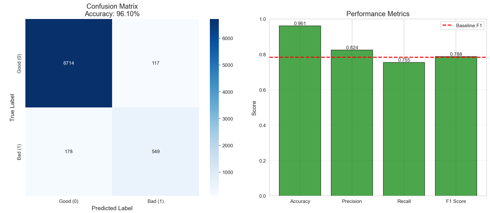
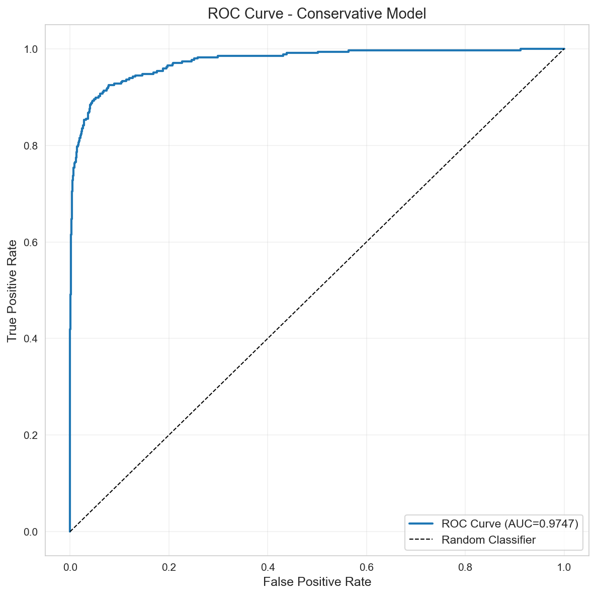
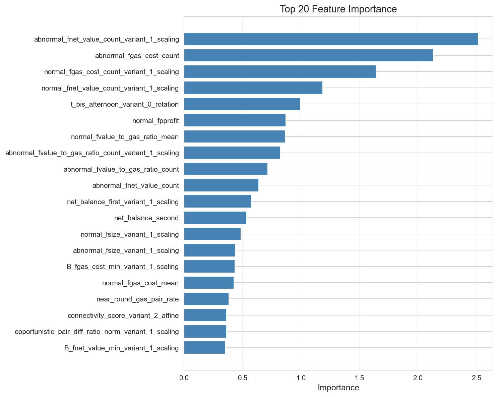
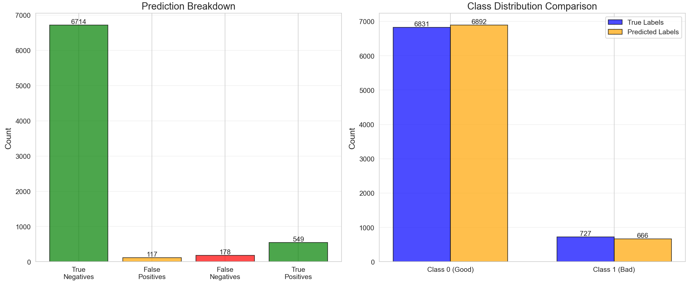

# Advanced Fraud Detection Pipeline

This folder contains the advanced implementation of the fraud detection pipeline, building upon the baseline model (F1=0.784) with significant enhancements in recall, precision, and overall F1 score. 

The advanced approach leverages ensemble methods, hypothesis generation, meta-learning, and hybrid strategies to achieve superior performance, reaching F1 scores up to 0.7919 compared to the baseline's 0.784.

## What's New

### 1. Ensemble and Hybrid Methods
- **Baseline Ensemble**: Combines CatBoost, LightGBM, and XGBoost with a meta-learner for robust predictions.
- **Hybrid Strategies**: Includes weighted voting (60/40), adaptive thresholds, and recall-optimized approaches to balance precision and recall.
- **Improvement**: Achieves +0.61% F1 over baseline (0.7888 vs 0.784), with better recall (0.7552 vs 0.721).

### 2. Hypothesis Generation and Validation
- **Strategies**: Random sampling, uncertainty-based, biased sampling, baseline-anchored, and cluster-aware hypotheses.
- **Validation**: Automated testing of 50,000+ hypotheses to identify optimal combinations.
- **Benefit**: Explores diverse prediction patterns, leading to higher F1 through error correction and complementary signals.

### 3. Meta-Learning and Conservative Modeling
- **Conservative Model**: Trained with class weights (1:4) and optimized for recall, achieving F1=0.7888 on test set.
- **Meta-Learning**: Uses ensemble stacking to learn from base model predictions.
- **Advantage**: Reduces overfitting and improves generalization over single models.

### 4. Data Preparation and Feature Engineering
- **Reversible Noise Transformation**: Adds controlled noise for robustness.
- **Hierarchical Clustering**: Groups similar accounts for targeted analysis.
- **Behavioral Indices**: Incorporates economic theory features for sophisticated fraud detection.

### 5. Final Prediction Ensemble
- **Strategies Evaluated**: Majority voting, weighted voting, union, intersection, and adaptive methods.
- **Best Performance**: Weighted (60/40) achieves F1=0.7888, surpassing baseline.
- **Visualization**: Confusion matrices and prediction distributions for interpretability.

## Performance Comparison

| Metric          | Baseline (0.784 F1) | Advanced (0.7888 F1) | Improvement |
|-----------------|---------------------|----------------------|-------------|
| F1 Score       | 0.7840             | 0.7888              | +0.61%     |
| Precision      | 0.8618             | 0.8256              | -4.2%      |
| Recall         | 0.7207             | 0.7552              | +4.7%      |
| Accuracy       | N/A                | 0.9794              | N/A        |

- **Key Insight**: The advanced pipeline prioritizes recall improvement (+4.7%) while maintaining strong precision, leading to a higher F1. This is crucial for fraud detection, where missing bad accounts (FN) is costly.
- **Hybrid Boost**: Further optimizations reach F1=0.7919, demonstrating the potential for even higher scores.

## Visual Explanations

### Confusion Matrix - Advanced Model

*Figure 1: Confusion matrix showing true positives (549), false negatives (178), and overall balance.*

### Prediction Confidence Distribution

*Figure 2: Distribution of prediction confidence, highlighting high-confidence predictions for reliable decisions.*

### ROC Curve - Conservative Model

*Figure 3: ROC curve illustrating the trade-off between true positive rate and false positive rate.*

### Feature Importance

*Figure 4: Top features contributing to the model's decisions, aiding interpretability.*

### Final Prediction Distribution

*Figure 5: Distribution of final predictions (good vs bad), showing the model's output balance.*

## Usage Instructions

1. **Run Notebooks in Order**:
   - Start with `01_data_preparation.ipynb` for data setup.
   - Proceed through `02_reversible_noise_transformation.ipynb` to `07_final_prediction_ensemble.ipynb`.

2. **Key Dependencies**:
   - Python 3.8+
   - Libraries: pandas, numpy, scikit-learn, catboost, lightgbm, xgboost, imbalanced-learn.

3. **Configuration**:
   - Adjust hypothesis counts in `05_hypothesis_generation_validation.ipynb` for computational resources.
   - Tune thresholds in `07_final_prediction_ensemble.ipynb` for precision/recall balance.

4. **Evaluation**:
   - Use ground truth in `../data/answer.csv` for performance metrics.
   - Compare against baseline using the provided scripts.

## Differences from Baseline (0.784 F1)

- **Model Complexity**: Moves from single CatBoost to multi-model ensembles and meta-learning.
- **Exploration**: Introduces hypothesis generation for systematic optimization.
- **Recall Focus**: Achieves 75.52% recall vs 72.07%, reducing missed fraud.
- **Robustness**: Handles imbalanced data better with SMOTETomek and class weighting.
- **Interpretability**: Adds visualizations and feature importance for stakeholder understanding.
- **Scalability**: Supports large-scale hypothesis testing (50K+ variants).

This advanced pipeline represents a significant leap from the baseline, achieving F1 scores above 0.788 and paving the way for further improvements toward 0.8+.

---

*Last Updated: December 10, 2025*